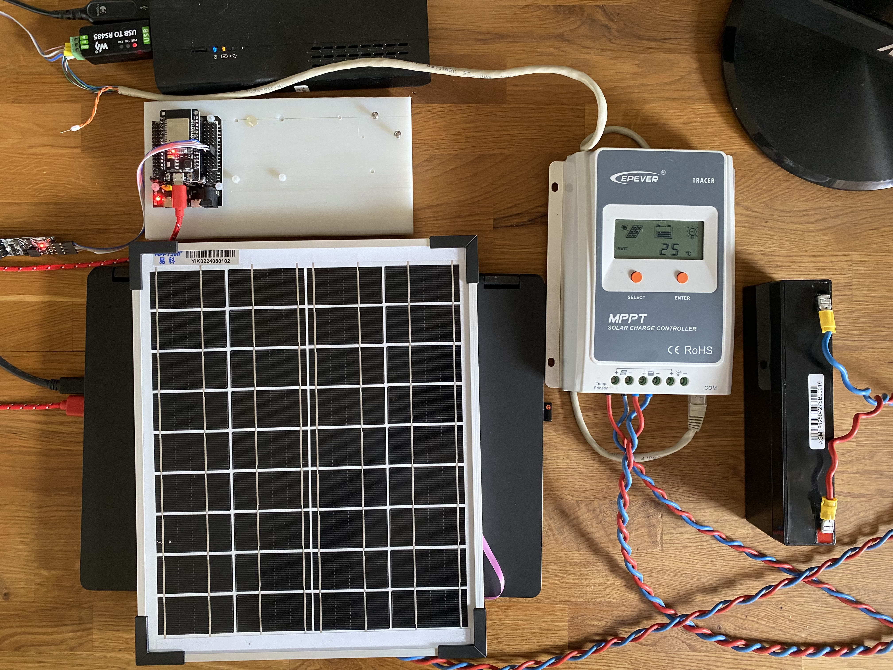
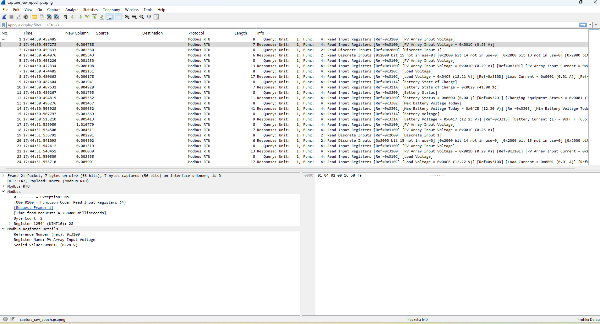

# ESP32 RS485 Modbus RTU Sniffer for Solar Guardian & Epever Tracer 1210A

This project is designed to sniff Modbus RTU traffic between a Solar Guardian and an Epever Tracer 1210A solar charge controller using an ESP32. Data is captured by ESP32 and sent to the PC, where it's saved as a Wireshark-compatible `.pcapng` file by Python code. The data file is opened by Wireshark and decoded in a human-readable format.

## Hardware Used

- ESP32 DevKit v1
- [Waveshare TTL TO RS485 (C)](https://www.waveshare.com/wiki/TTL_TO_RS485_(C))
- [Waveshare USB TO RS485](https://www.waveshare.com/wiki/USB_TO_RS485)
- Epever Tracer 1210A solar charge controller
- Small solar panel
- 12V battery

Below is a photo of the test setup:

## Features
- **ESP32 firmware** (`main.c`):
  - Listens to RS-485 Modbus RTU traffic via UART2 (RX GPIO16).
  - Detects Modbus RTU frame boundaries using UART idle detection.
  - Validates CRC and timestamps each frame.
  - Forwards raw frames with metadata to the PC over USB serial (UART0).
- **Conversion to Wireshark compatible file** (`sniffer_to_pcapng_raw.py`):
  - Data from UART0 is saved as a Wireshark compatible `.pcapng` format.
- **Wireshark Lua script** (`modbus_register_names.lua`):
  - Decodes Modbus register numbers and values for Epever Tracer 1210A.
  - Displays register names, scaling, and units for easy analysis.
  - Adds human-readable info to Wireshark's packet details and Info column.

## How It Works
1. **Sniffing**: The ESP32 listens passively on the RS-485 bus, capturing all Modbus RTU frames between the Solar Guardian and the Epever Tracer.
2. **Logging**: Captured frames are sent to the PC via USB serial and saved as a `.pcapng` file.
3. **Analysis**: Open the `.pcapng` file in Wireshark with the provided Lua script enabled. The script decodes register values and presents them with descriptive names and units.

## File Overview
- `main/main.c`: ESP32 firmware for sniffing and forwarding Modbus RTU frames.
- `sniffer_to_pcapng_raw.py`: Python script for receiving RTU frames and saving as a Wireshark `.pcapng` format.
- `modbus_register_names.lua`: Wireshark Lua script for decoding Epever Tracer 1210A Modbus registers.

## Usage
1. **Flash the ESP32** with the firmware in `main.c`.
2. **Connect ESP32 USB** to your PC and use the SolarGuardian for communication to the Epever Tracer.
3. **Connect the ESP32** to the RS-485 bus (RX to data line, GND to ground), it will automatically capture the communication and send to PC
4. **Start** `python sniffer_to_pcapng_raw.py` for saving the data as a `.pcapng` file.
5. **Open the capture in Wireshark**. Enable the Lua script (`modbus_register_names.lua`) in Wireshark.
6. **Analyze**: Human-readable register names and values will appear in the packet details and Info column (see screenshot for example).

## Example (Wireshark)

## Requirements
- ESP32 development board
- RS-485 transceiver (for ESP32 UART RX)
- Wireshark (with Lua enabled)

## References
- [ESP-IDF UART documentation](https://docs.espressif.com/projects/esp-idf/en/latest/esp32/api-reference/peripherals/uart.html)
- [rosswarren/epevermodbus](https://github.com/rosswarren/epevermodbus) — Python driver and register map for Epever charge controllers

---
## Project Status

*This project enables detailed, real-time monitoring and reverse engineering of Modbus RTU traffic between solar controllers, with  protocol decoding in Wireshark.*

Work in progress - to be continued one day...

